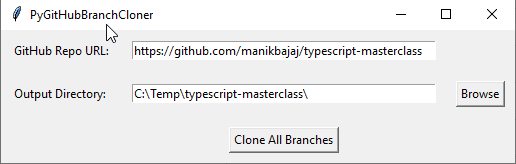

# PyGitHubBranchCloner
A Python tkinter GUI to clone all branches of a repo.

## Pre-requisites:
```
pip install GitPython
```

## Usage
### Create a virtual environment
 - ```cd path\to\your\project```


```
python PyGitHubBranchCloner.py
```

## Screenshots
\

